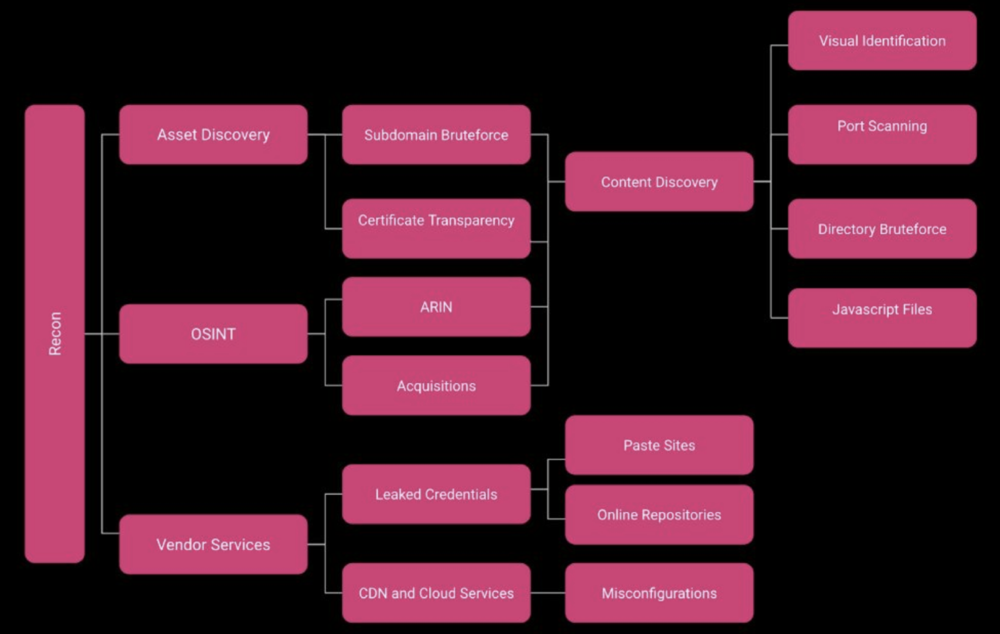
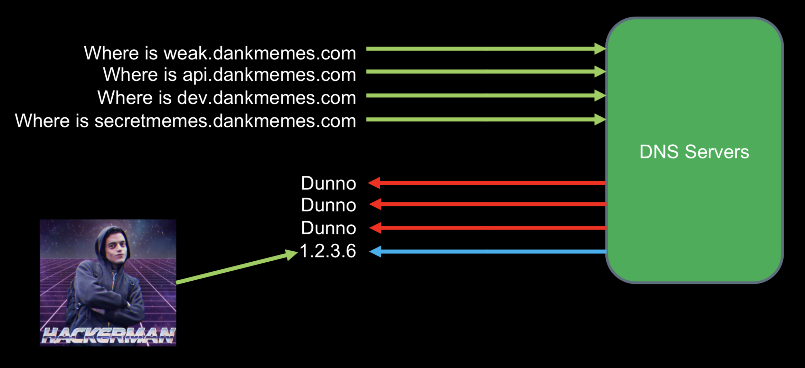
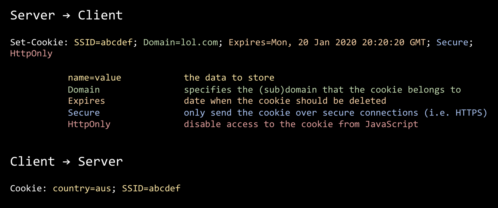
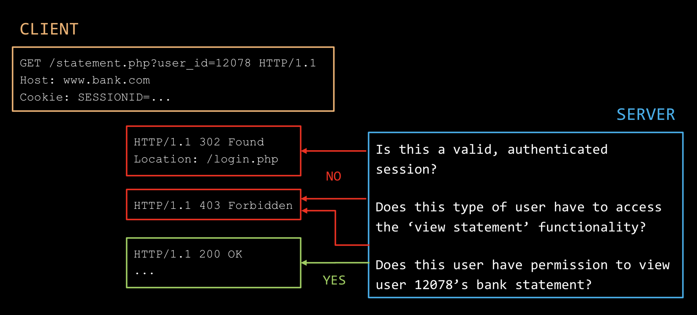
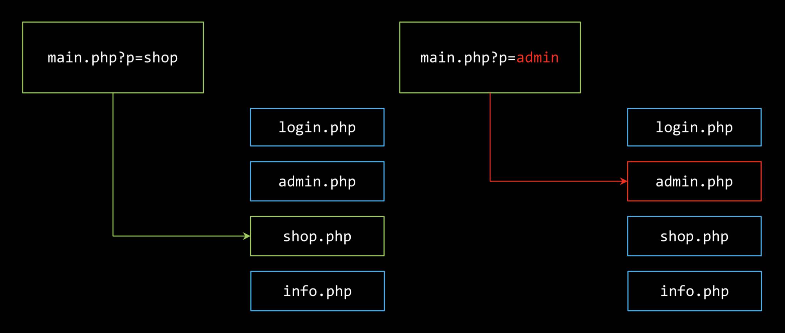
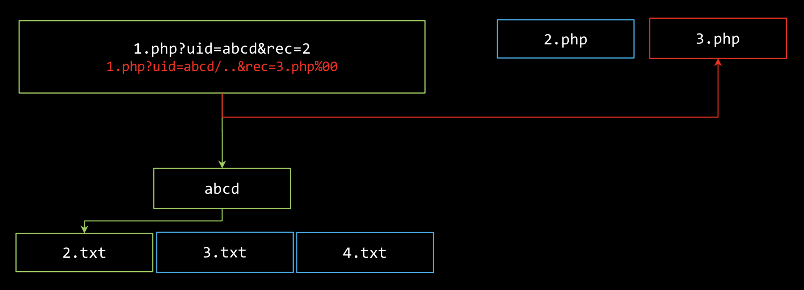
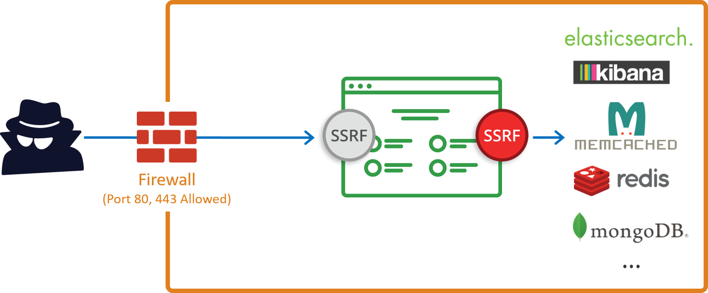

# COMP6443 Summary Notes

## Threat Modelling

- Define your security requirements based on what you're trying to protect, before implementing
- Building a threat model
  - Why would someone attack me?
  - What should I be worried about?
  - Who is my adversary?
- Watch out for bias and scope:
  - What are we trying to protect?
  - What can go wrong?
  - What are we going to do about it?
  - How much does it cost?
  - Is it feasible?
- Security from a defender's perspective:

  | Most investment  | Some investment   | Least investment       |
  | ---------------- | ----------------- | ---------------------- |
  | www.website.com  | blog.website.com  | api.website.com        |
  | shop.website.com | stage.website.com | dev.website.com        |
  |                  | db.website.com    | backup-syd.website.com |
  |                  |                   | archive.website.com    |
  |                  |                   | S3 buckets             |
  |                  |                   | GitHub                 |
  |                  |                   | Pastebin               |
  |                  |                   | Third-party providers  |
  |                  |                   | Mobile applications    |
  |                  |                   | Analytics              |
  |                  |                   | etc.                   |

## Recon / Asset Discovery

### Source of vulnerabilities

- "Yeah that's a legacy system, we have to keep it on that version for compatibility"
- "Oh wow, that system is still up?"
- "Sorry, we're not responsible for marketing systems, go to <X>"
- These are the result of poor threat modelling

### Attack techniques

- Google search:
  - "site:uber.com inurl:admin" – this will search through Uber's domains which have 'admin' in the URL
  - Use a custom search range of, say, 2000-2009 to identify old domain names (which would probably be less secure)
- Spidering: crawl every link starting from `/`
- Brute-forcing: try all entries in a given wordlist
  - Do permutations too
  - Have different wordlists for different contexts – e.g. directories, subdomains, users
- Attacking WAFs:

  ```
  <scrRipt>
  ```

  ```
  <sc<script>ript>
  ```

  ```
  OR 2=2
  ```

- Crawling GitHub: look in git history, code commits, issues, etc.

### Finding the gaps



### DNS recon



- This is typically done via subdomain brute-forcing and reverse DNS lookup
- We generally can't trust DNS completely – it operates over an unsecured protocol that can be tampered with

### Defensive techniques

- Identify your assets before your adversaries do
- Trust no-one: never assume your test environment is the same as your production environment
- Minimise the attack surface:
  - Do I need it? If not, remove it
  - Restrict access to necessary people only, and require them to authenticate
  - Follow the Principle of Least Privilege

## SQL injection (SQLi)

- Application-layer vulnerabilities arise when an application fails to securely handle unexpected (or lack of expected) input and conditions
- The database engine is not designed to tell the difference between code and data. It is generally a bad idea when control and data share the same band.

### In-band SQLi

- Using the same communication channel to both launch the attack and gather resuts
- Error-based SQLi: injecting special characters like `'` to cause an exception
- Union-based SQLi: leveraging the `UNION` operator to combine the resuts of two or more `SELECT` statements into a single result which is then returned as part of the HTTP response
- Fingerprinting SQLi: determining the exact DBMS driving the backend and tailoring further attacks from this information

### Blind SQLi

- Applies when you can't directly extract data by selecting it into a colulmn
- Although no data is actually transferred via the web application, you can reconstruct the database structure by sending payloads and observing the response / behaviour of the server
- This attack is often used when the web application is configured to show generic error messages, but has not mitigated the code that is vulnerable to SQL injection
- Boolean-based blind SQLi: sending a query to the DB which forces the application to return a different result depending on whether the query returns `TRUE` or `FALSE`
  - `http://newspaper.com/items.php?id=2 and 1=1` (this would be `TRUE`)
  - `http://newspaper.com/items.php?id=2 and 1=2` (this would be `FALSE`)
- Time-based blind SQLi: sending a query to the DB which forces the application to wait for a specified amount of time depending on whether the query returns `TRUE` or `FALSE`
  - "Is the first letter of the password 'a'? If yes, sleep for 5 seconds, otherwise, do nothing"

### Defensive techniques

- Prepared statements with parameterised queries force the SQL engine to cleanly segregate code and data
- Escape special characters
- Reduce attack surface by minimising the privilege level of your database user
- Filter user input and handle error messages gracefully

## Authentication

### Definitions

- Authentication: is the user who they claim to be?
- Session management: is it still that user?
- Access control: is the user allowed to access this resource?

### Web authentication

- Username / password
  - Password reset via email
  - 2FA: SMS, token, apps
    - Active 2FA: typing in a OTP generated on your phone
    - Passive 2FA: a digital certificate being sent behind the scenes when you have a device plugged in
- Delegated
  - SSO
  - OAuth

### Attack techniques

- Try default credentials
- Exploit information disclosure
  - "Login failed: invalid username"
  - "Login failed: invalid username or password"
- Password resets
  - Email
    - Game over if you have access to the user's inbox
    - Is the reset link generated securely?
  - Security questions
    - Get answers off information from a user's social media platforms
    - Google the answer
- Brute-force
  - Attempt logins with common passwords
  - Try known email/password combinations from previous breaches

### Defensive techniques

- Login rate-limiting and lockouts
- CAPTCHA
- Proactive monitoring
- User communication: password security is a _people_ problem

## Session Management

- HTTP is stateless; it only recognises users by some information in the request like the header or a cookie
- A user does not need to be logged in to be associated with a session ID – the cookie can be assigned as soon as they visit the page

### Anatomy of a cookie



### Attacking sessions

- Session creation
  - How are sessions created? Can I fake my own session?
  - Can I attack the PRNG and generate my own cookie?
  - Can I 'fixate' a session (assign the session cookie to a different user)?
- Session handling / transfer / usage
  - Can I steal the cookie through XSS (no `HttpOnly` flag)?
  - Can I steal the cookie through redirecting to HTTPS?
  - What information does the site trust the user to provide?
- Session cleanup
  - What happens when I click 'Log Out'? Sometimes clicking the back button in a browser after logging out will render a cached version of the page where buttons don't work, but if that page contains sensitive information like someone's transaction history with a bank, that still needs to be fixed.
  - Under what conditions is a session actually destroyed? What happens then?
  - Do sessions time out correctly?

## Cross-Site Request Forgery (CSRF)

- CSRF is an attack in which the attacker can send a crafted URL or page to the victim. They can then forge requests in the name of the victim and forcibly perform unwanted actions.
- It doesn't really make sense to try CSRF on pages that don't require authentication – e.g. to unsubscribe someone from a mailing list, can just type in their email, don’t need to craft a special URL or HTML page to do that
- CORS makes CSRF much more difficult but doesn't mitigate it completely

### How it works

- If you visit www.website.com, your browser sends your cookie
- If I make you visit www.website.com, your browser sends your cookie
- If I make you visit www.website.com/?action=new_admin&user=cyber&pw=lol123, your browser sends **your cookie**

### Defensive techniques

- CSRF tokens
  - With every request, you send a unique token to confirm you are running from the site the server is expecting
  - Can be bypassed with XSS
  - Relies on secure tokens and consistent rolling usage
- Compare source and target origin
  - Some headers can't be tampered with by code running on the browser
- Minimise attack surface
  - Session should be managed on the server side where possible, using a single session token
- Mostly mechanical fixes
  - Don't let people steal your tokens
  - Don't let people reuse tokens (expire them properly, log out)
  - Don't let people generate tokens (secure PRNG, avoid rolling your own crypto, don't allow users to supply tokens)

## Access Control

### Types of access control

- Security through obscurity
- One-off access control
- Rule-based access control
- Role-based access control
  - Horizontal access control is making sure one user can't access a different user's data without permission
    ```
    http://bank.com/statement.php?user_id=12078
    ```
  - Vertical access control is making sure only administrative users can access administrative content. Attacking vertical access control is commonly known as privilege escalation.
    ```
    http://bank.com/admin.php
    ```

### Attacking access control

- Bypass entirely: go directly to 'hidden' subdomains like api.website.com
  - Look through `robots.txt` to find these
  - Brute-force the directories an admin might have access to, e.g. `/admin`
  - If the developer only wrote a rule restricting access to a directory but not the pages inside that directory, `/admin` might display a login screen but `/admin/dashboard.jsp` would be directly accessible without needing to log in
  - It is a common vulnerability for the response from a REST API to contain sensitive information that is hidden from the frontend but visible in plain sight using tools like BurpSuite (just intercept the response)
    - Many REST APIs are designed to be consumed cross-platform
    - Different platforms with different IP addresses may have different vulnerabilities (more attack surfaces)
- Copy legitimate users
  - Change `GET` or `POST` parameters
- Actual testing
  - How does the application know what user role I am? Are checks applied consistently throughout the application? What happens when a check fails?
  - What aspects of this information can I control? Can I impersonate another user or role? What about content which has zero access control?

### Towards better access control



- If you put 403 as a response code to a user accessing content they shouldn't, you will have confirmed for them that this is privileged content
  - Do you want them to know they've been denied access to something?
  - Putting 200 or 302 instead and redirecting them to login mitigates fingerprinting

## Cross-Site Scripting (XSS)

### Definition

1. Provide data to an application (e.g. `<script>alert(1)</script>`)
2. Data is rendered without filtering
3. Arbitrary code gets executed by victim's browser

### Who is vulnerable?

- Because JavaScript is so widely used, many web apps are vulnerable to XSS
- With Electron and similar frameworks that use web technologies, even some desktop/mobile apps are vulnerable to XSS
- To check for output sanitisation, enter special characters as input: `>><>*)(*(`
  - In the page source, if those characters have been converted to HTML-encoded characters (e.g. `&lt;`), they are being sanitised to protect against XSS

### Types of XSS

| Reflected XSS                              | Stored XSS                                     | DOM-Based XSS                               |
| ------------------------------------------ | ---------------------------------------------- | ------------------------------------------- |
| Content in a request is directly reflected | Content is stored in persistent storage        | Matter of intense philosophical debate      |
| Targets a single user                      | One attack, many victims                       | Poorly defined                              |
| To exploit, send a malicious link          | To exploit, input a malicious payload and wait | Can be reflected or stored (doesn't matter) |

### DOM-based XSS

- Possible if the web application writes data to the DOM without proper sanitisation
- Exploits inappropriate manipulation of DOM objects and properties in _client-side_ code
- The HTML page is static and there are no malicious scripts embedded into the page source code
- The script code never reaches the server if you use the `#` character, as this is seen as a fragment and the browser does not forward it. This means server-side attack detection tools are unable to detect this attack.

### Avenues of attack

- Every field where user can give input
- URI-based
- Hidden parameters
- File uploads
- HTTP headers
- Intentionally invalid requests (can be useful because only admins will see them in logs, so that is an easy way to get an admin cookie)
- Exploit automated systems (e.g. link previews in Slack)
- Browser extensions are valuable targets (more so than web pages) as they run within the browser with special privileges
- What else is unsanitised because the server isn't expecting it?

### Implications

- Abuses the trust a user has in a website. You can `document.write` the entire page away, but have a trusted domain in the URL.
- Frameworks exist to leverage XSS to gain control of user accounts
- XSS combined with CSRF:
  - Even if an application has CSRF protection, this means nothing if you have XSS on the domain as you can bypass SOP
  - This is because any request made by the XSS has originated from the same domain. Simply use a `GET` to pull the CSRF token from a form and make the `POST` to the endpoint.

### Defensive techniques

- Make no assumptions
  - Don't trust user input. Before you use an input, validate it.
  - Don't trust other systems you talk to. Validate all data you rely on.
  - Validate both format and value – attacks aren't just semantic
- Filter input
  - Whitelist if possible, otherwise blacklist
- Content security policy
  - Headers that tell the browser what content it can render, and from where it is allowed to source it
  - CSP isn't fool-proof – an attacker just has to make sure their payload is executing from the same source as what has been allowed by the header

## Server-Side Attacks

### File upload

- Insert a malicious macro into an excel document, upload it and hope someone opens that file
- Upload an HTML file → www.website.com/upload/1.html → phishing page accessible from website's domain
- Bypassing client-side file type validation: from a malicious file payload.php, create a copy called payload.jpeg and upload it, intercept with BurpSuite and change the file extension to .php
- Add XSS to SVG files by including an extra `<script>` section
- Upload a file with special characters in the filename, e.g. `/etc/passwd`

### Command injection

- When some application takes user input and uses it to form part of a command
- For example, if a server ran `cat $zid.submission` whenver a student tried to check their mark, you can replace your zID with your own code (much like in SQLi), except here you have full access to everything a shell can do

### Server-Side Includes (SSI) injection



- Using SSI directives, dynamic page content can be embedded into an existing HTML page and then displayed
- It is possible to pass in the name of a different file to display, perhaps one with access to sensitive content like `admin.php`

### Directory traversal



- An attacker can make use of this vulnerability to step out of the web root directory and access other parts of the file system
- This might give them the ability to view restricted files, from which they could gather more information required to further compromise the system

### Server-side request forgery



- Instead of you making a request, making the web server make a request on your behalf
- This way, you have access to the internal network which is often not as secure or well authenticated as the external-facing applications

### Reverse shell

- The attacker opens up a port on their own machine and waits for incoming connections. Then they make the victim initiate a connection back to them (e.g. through command injection).
- Here, the attacker's machine acts as a server and the victim's machine acts as a client
- Often used when you can't directly initiate a connection to a machine but it can initiate a connection to you. This works because outgoing traffic is less likely to be filtered by the victim's firewall.
